<div align="center">


# 🎓 LMPTS
### Learning Management & Prerequisite Tracking System

> A full-featured academic course management system with intelligent
> prerequisite tracking, dual desktop + web interfaces, and
> graph-powered learning path recommendations.

<br>

[](https://python.org)
[](https://flask.palletsprojects.com)
[](https://sqlite.org)
[](https://docs.python.org/3/library/tkinter.html)
[](https://pytest.org)
[](LICENSE)

<br>

[](https://github.com/NadakuditiTarunBalaji/LMPTS/stargazers)
[](https://github.com/NadakuditiTarunBalaji/LMPTS/network/members)
[](https://github.com/NadakuditiTarunBalaji/LMPTS/issues)

<br>

[📖 Documentation](#-documentation) •
[🚀 Quick Start](#-quick-start) •
[✨ Features](#-features) •
[🏗️ Architecture](#-architecture) •
[🧪 Testing](#-testing) •
[👥 Team](#-team)

</div>

---

## 📋 Table of Contents

- [What is LMPTS?](#-what-is-lmpts)
- [Key Differentiators](#-key-differentiators)
- [Features](#-features)
- [Tech Stack](#-tech-stack)
- [Quick Start](#-quick-start)
- [Default Credentials](#-default-credentials)
- [Screenshots](#-screenshots)
- [Architecture](#-architecture)
- [Database Design](#-database-design)
- [User Roles](#-user-roles)
- [Workflows](#-workflows)
- [API Reference](#-api-reference)
- [Testing](#-testing)
- [Project Structure](#-project-structure)
- [Documentation](#-documentation)
- [Team](#-team)
- [License](#-license)

---

## 🎓 What is LMPTS?

**LMPTS** is a desktop + web learning management system that solves a
problem traditional LMS platforms ignore: **intelligent prerequisite
tracking**.

Instead of manually checking whether a student can take a course,
LMPTS builds a **directed acyclic graph** of course dependencies,
uses **DFS** to detect circular prerequisites before they are saved,
generates **BFS-shortest learning paths**, and scores personalized
recommendations using a **multi-factor algorithm** — all while
supporting full approval workflows for registrations, course
submissions, transfer credits, and enrollment cancellations.

It ships with **two complete front ends** — a Tkinter desktop app
and a Flask web app — both powered by the exact same service and
algorithm layer so business rules are identical no matter which
interface is used.

---

## ⚡ Key Differentiators

| Feature | Traditional LMS | LMPTS |
|---------|----------------|-------|
| Prerequisite management | Manual checking | ✅ Automated graph-based validation |
| Cycle detection | ❌ Not available | ✅ DFS-based circular dependency detection |
| Learning path | Manual planning | ✅ Auto-generated via Topological Sort + BFS |
| Transfer credits | Simple checkbox | ✅ Full 3-step: Learner → Instructor → Admin |
| Recommendations | ❌ None | ✅ Scored multi-factor engine (0–100) |
| Account activation | Auto-active | ✅ Admin approval workflow |
| Enrollment cancellation | ❌ None | ✅ Learner request → Instructor review |
| Analytics | Basic reports | ✅ Bottleneck detection + 10 Chart.js charts |
| Interfaces | One UI | ✅ Desktop (Tkinter) + Web (Flask) |

---

## ✨ Features

<details>
<summary><strong>👤 Authentication & Account Management</strong></summary>

<br>

- bcrypt password hashing — passwords never stored as plain text
- Four roles: **Admin**, **Instructor**, **Learner**, **Analyst**
- Self-registration with **admin approval workflow**
- Account statuses: `PENDING → ACTIVE / REJECTED`, `ACTIVE ⇄ INACTIVE`
- Specific login rejection messages per account status
- Password strength meter with live scoring (0–100)
- Profile management: full name, email, bio, difficulty preference
- Forced re-login after password change
- Security notification on every password or email change

</details>

<details>
<summary><strong>📚 Course Management</strong></summary>

<br>

- Full CRUD: code, name, description, difficulty, duration
- Course lifecycle: `DRAFT → PUBLISHED → ARCHIVED`
- Instructors create drafts and submit for admin review
- Admin approves (auto-publishes) or rejects with mandatory feedback
- Only `PUBLISHED` courses are open for learner enrollment

</details>

<details>
<summary><strong>🔗 Prerequisite Graph</strong></summary>

<br>

- Directed Acyclic Graph (DAG) of all course dependencies
- **DFS cycle detection** — rejects circular prerequisites before saving
- Visual graph canvas in desktop app
- Topological sort into parallel study levels (Kahn's algorithm)
- Transitive prerequisite calculation — all ancestors in dependency chain

</details>

<details>
<summary><strong>🎯 Enrollment & Progress</strong></summary>

<br>

- Enrollment blocked if prerequisites not met — missing courses listed
- Satisfied credits union:
  `completed ∪ transfer_credits ∪ exemptions ∪ placement_tests`
- Enrollment state machine:
  `ENROLLED → IN_PROGRESS → COMPLETED / CANCELLED`
- Fine-grained progress tracking: 0–100% with auto-status adjustment
- Transfer credit and exemption grants (admin only)
- Atomic transactions: enrollment + progress always created together

</details>

<details>
<summary><strong>🚫 Enrollment Cancellation Requests</strong></summary>

<br>

- Learner can request cancellation only if status is `ENROLLED`
- Workflow: Learner submits → Instructor approves or rejects
- Instructor approves → enrollment + progress deleted,
  learner can re-enroll later
- Learner can withdraw their own `PENDING` request at any time

</details>

<details>
<summary><strong>🔄 Prior Learning / Transfer Credit</strong></summary>

<br>

- Three pathways: **Transfer Credit** / **Prior Assessment** /
  **Exemption Request**
- Evidence description (minimum 30 characters) required
- Two-stage review: Instructor recommendation → Admin final decision
- Approval automatically grants transfer credit for the course
- Learner tracks status and sees all notes at each stage

</details>

<details>
<summary><strong>🗺️ Learning Paths & Recommendations</strong></summary>

<br>

- BFS shortest path to any goal course
- Personalized roadmap with completed / in-progress / remaining breakdown
- Multi-factor recommendation scoring:

  | Factor | Weight |
  |--------|--------|
  | Prerequisite readiness | 40% |
  | Difficulty preference match | 30% |
  | Remaining path length | 20% |
  | Course duration | 10% |

</details>

<details>
<summary><strong>📊 Analytics & Reporting</strong></summary>

<br>

- System overview: total courses, learners, enrollments, completion rate
- Per-course: completion rate, dropout rate, average score, chain length
- Bottleneck detection with configurable dropout threshold
- **Web dashboard**: 10 Chart.js charts across 5 sections
- **Desktop dashboard**: matplotlib bar chart + summary tables
- Every table and chart degrades to **"No Data Available"**
  on an empty database

</details>

<details>
<summary><strong>🔔 Notification System</strong></summary>

<br>

| Event | Notified |
|-------|---------|
| New learner self-registers | All admins |
| Registration approved / rejected | Learner |
| PLR request submitted | All instructors |
| PLR approved / rejected | Learner |
| Course submitted for review | All admins |
| Course approved / rejected | Instructor |
| Password / email changed | User |
| Account deactivated / reactivated | User |

</details>

---

## 🛠️ Tech Stack

<div align="center">

| Component | Technology | Version | Purpose |
|-----------|-----------|---------|---------|
| **Language** | Python | 3.11+ | Core application |
| **Desktop UI** | Tkinter (ttk) | Built-in | Desktop interface |
| **Web UI** | Flask + Jinja2 | 3.0 | Browser interface |
| **Charts (Web)** | Chart.js | 4.4 | Analytics visualizations |
| **Charts (Desktop)** | matplotlib | 3.x | Analytics bar chart |
| **Database** | SQLite (WAL mode) | Built-in | Data persistence |
| **Password Hashing** | bcrypt | 4.x | Secure password storage |
| **Testing** | pytest + pytest-cov | 7.x | Test suite + coverage |

</div>

---

## 🚀 Quick Start

### Prerequisites

```
Python 3.11+    pip    Git
```

### Installation

```bash
# 1. Clone the repository
git clone https://github.com/NadakuditiTarunBalaji/LMPTS.git
cd LMPTS

# 2. Create virtual environment
python -m venv .venv

# Windows PowerShell
.venv\Scripts\Activate.ps1

# Windows CMD
.venv\Scripts\activate.bat

# Linux / Mac
source .venv/bin/activate

# 3. Install dependencies
pip install -r requirements.txt

# 4. Seed the database with sample data
python seed_courses.py
```

### Launch Desktop App

```bash
python gui/app.py
```

### Launch Web App

```bash
python run_web.py
# Open: http://127.0.0.1:5000
```

### Verify Installation

```bash
python -c "
import bcrypt, flask, matplotlib, tkinter, sqlite3
print('All dependencies OK')
print(f'Python:     {__import__(\"sys\").version}')
print(f'bcrypt:     {bcrypt.__version__}')
print(f'Flask:      {flask.__version__}')
print(f'SQLite:     {sqlite3.sqlite_version}')
"
```

---

## 🔑 Default Credentials

<div align="center">

| Username | Password | Role | Access Level |
|----------|----------|------|-------------|
| `admin` | `admin123` | Administrator | Full system control |
| `learner` | `learner123` | Learner | Self-directed learning |
| `analyst` | `analyst123` | Analyst | Read-only analytics |
| `instructor` | `instructor123` | Instructor | Course + learner management |

</div>

> ⚠️ **Change all default passwords before any real use.**

### Sample Courses (Seeded)

<div align="center">

| Course | Name | Prerequisites | Difficulty |
|--------|------|--------------|-----------|
| `CS101` | Intro to Computer Science | None | Beginner |
| `CS102` | Programming Fundamentals | None | Beginner |
| `PY101` | Python Basics | None | Beginner |
| `CS201` | Data Structures | CS101, CS102 | Intermediate |
| `CS301` | Algorithms | CS201 | Advanced |
| `ML101` | Machine Learning Intro | CS201 | Advanced |

</div>

---

## 📸 Screenshots

> **Note for contributors:** Add screenshots to `docs/screenshots/`
> and they will render here automatically.
> See [`docs/screenshots/README.md`](docs/screenshots/README.md)
> for naming conventions and capture instructions.

### Desktop Application (Tkinter)

<table>
  <tr>
    <td align="center">
      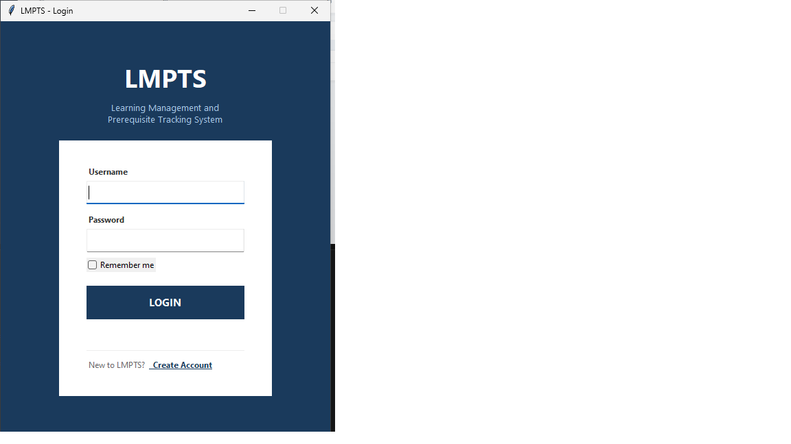
      <br><b>Login Screen</b>
    </td>
    <td align="center">
      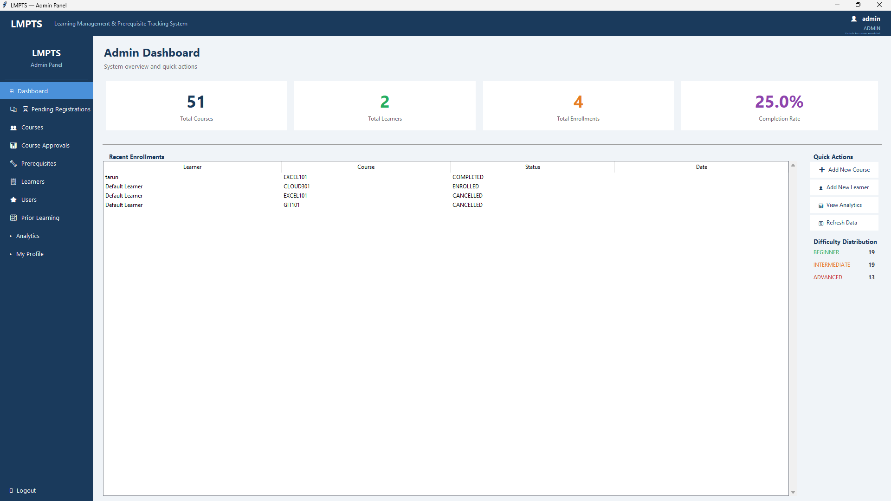
      <br><b>Admin Dashboard</b>
    </td>
  </tr>
  <tr>
    <td align="center">
      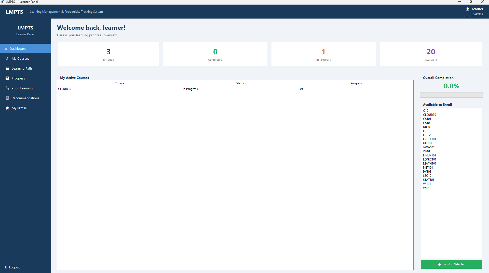
      <br><b>Learner Dashboard</b>
    </td>
    <td align="center">
      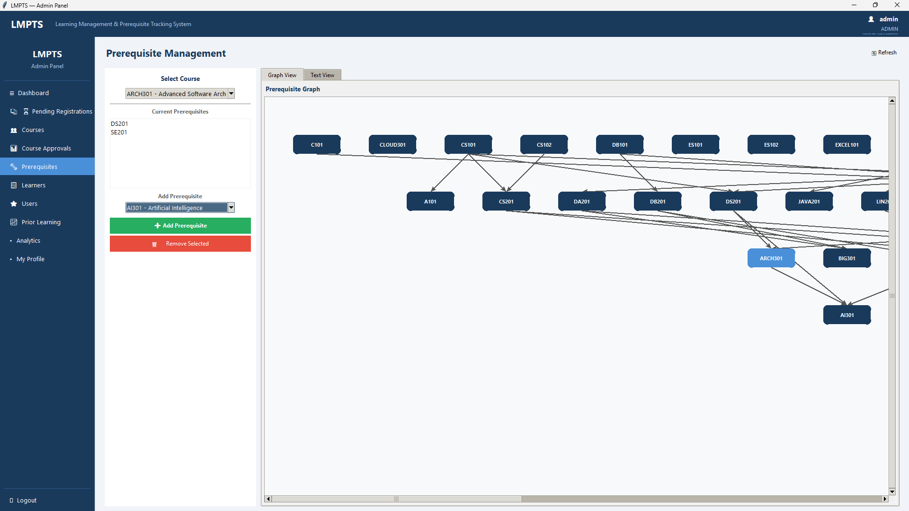
      <br><b>Prerequisite Graph Canvas</b>
    </td>
  </tr>
  <tr>
    <td align="center">
      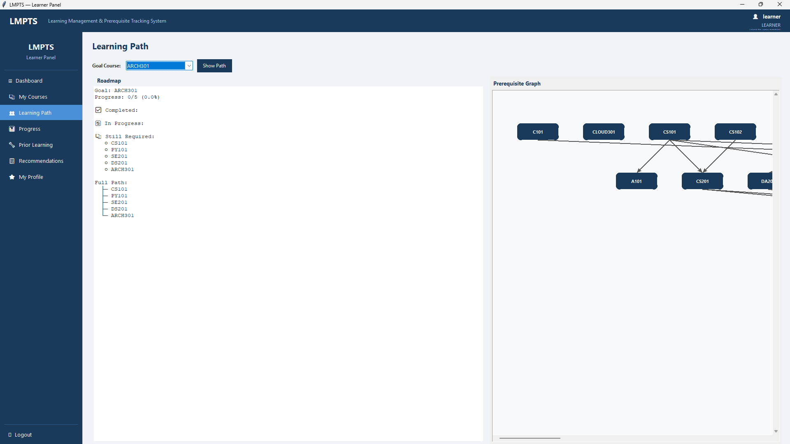
      <br><b>Learning Path Roadmap</b>
    </td>
    <td align="center">
      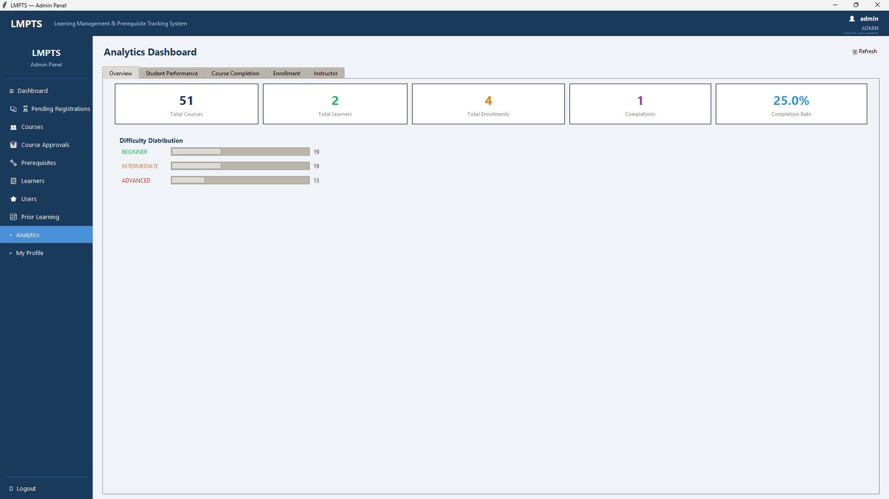
      <br><b>Analytics Dashboard</b>
    </td>
  </tr>
</table>

### Web Application (Flask)

<table>
  <tr>
    <td align="center">
      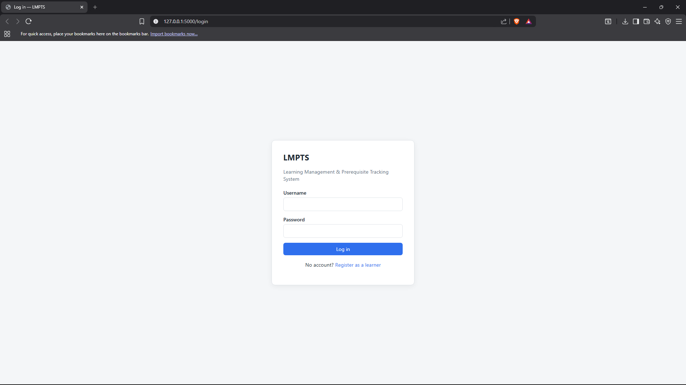
      <br><b>Web Login</b>
    </td>
    <td align="center">
      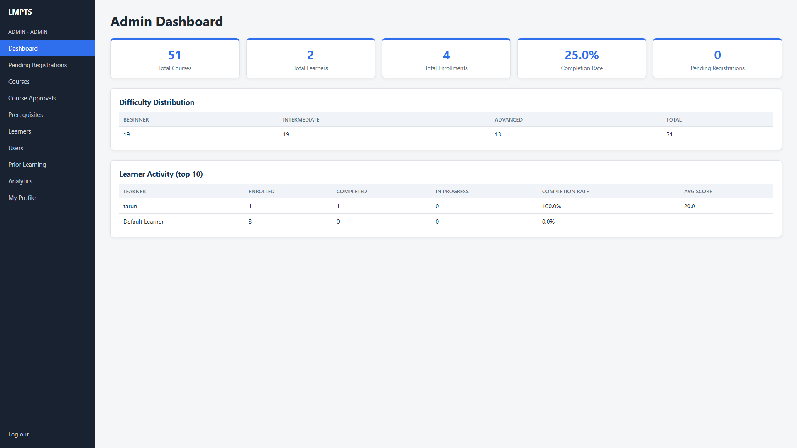
      <br><b>Web Admin Dashboard</b>
    </td>
  </tr>
  <tr>
    <td align="center">
      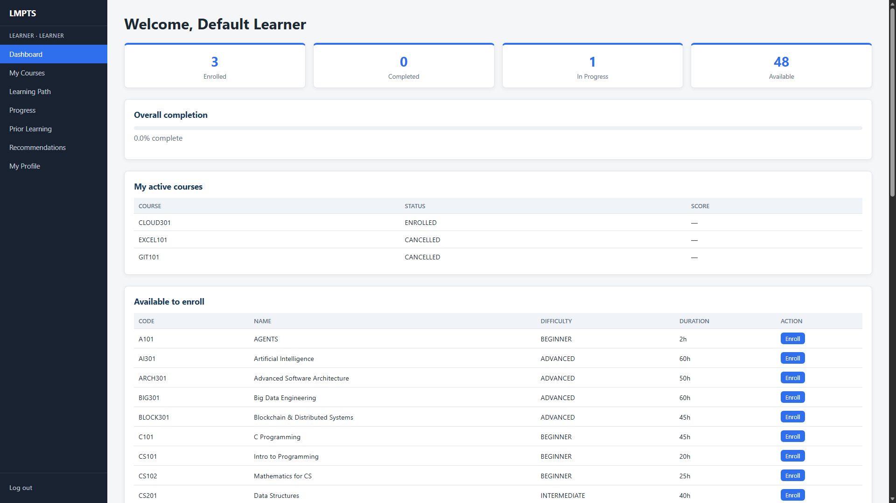
      <br><b>Web Learner Dashboard</b>
    </td>
    <td align="center">
      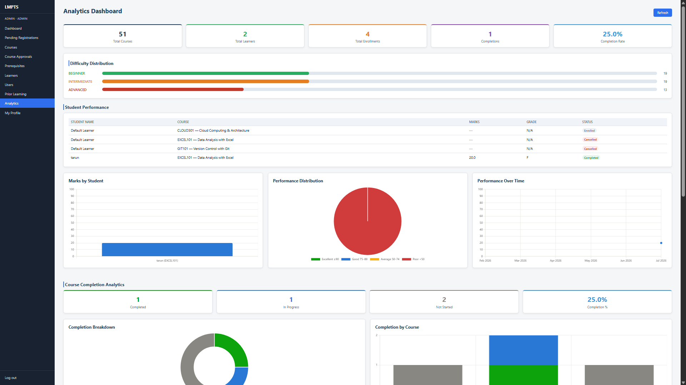
      <br><b>Web Analytics — 10 Charts</b>
    </td>
  </tr>
  <tr>
    <td align="center">
      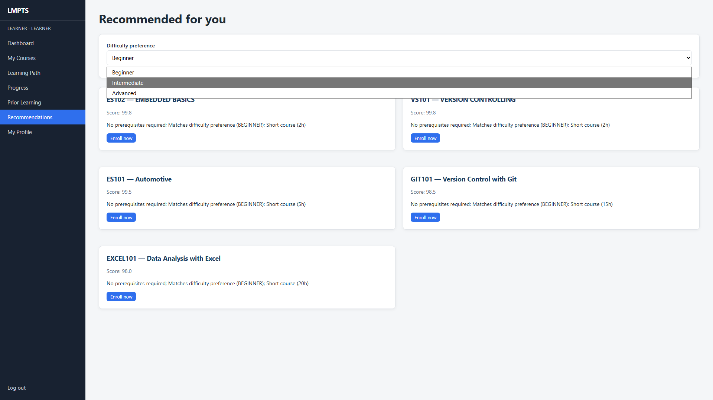
      <br><b>Course Recommendations</b>
    </td>
    <td align="center">
      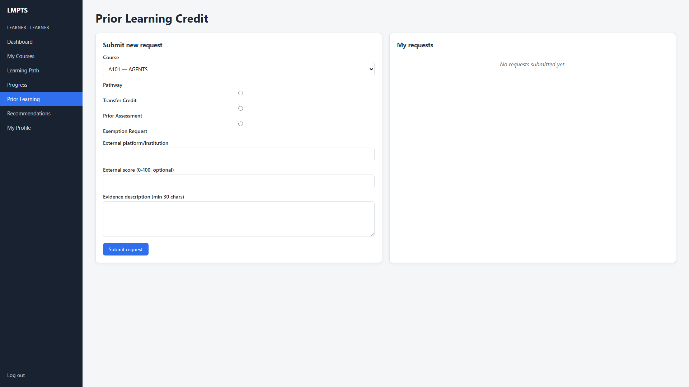
      <br><b>Prior Learning Request</b>
    </td>
  </tr>
</table>

---

## 🏗️ Architecture

### Layered Design

```
┌──────────────────────────────────────────────────────┐
│     Desktop UI (Tkinter)   │   Web UI (Flask)         │
│     gui/app.py             │   run_web.py             │
└───────────────────┬────────────────────┬─────────────┘
                    │  call into         │  call into
                    │  (same objects)    │  (same objects)
┌───────────────────▼────────────────────▼─────────────┐
│                    Service Layer                       │
│  CourseService        EnrollmentService               │
│  ProgressService      AnalyticsService                │
│  LearningPathService  RecommendationService           │
│  PriorLearningService AccountService                  │
│  ProfileService                                        │
└──────────┬────────────────────────┬──────────────────┘
           │                        │
┌──────────▼──────────┐   ┌─────────▼──────────────────┐
│   Algorithm Engine   │   │      Repository Layer       │
│  CourseGraph (DAG)   │   │  UserRepo                   │
│  CycleDetector (DFS) │   │  CourseRepo                 │
│  PathFinder (BFS)    │   │  LearnerRepo                │
│  TopologicalSorter   │   │  EnrollmentRepo             │
│  PrereqValidator     │   │  ProgressRepo               │
│  RecommendEngine     │   │  PriorLearningRepo          │
└─────────────────────┘   │  CancellationRequestRepo    │
                           └─────────┬──────────────────┘
                                     │
                           ┌─────────▼──────────────────┐
                           │    Core Models + Auth       │
                           │  User  Course  Learner      │
                           │  Enrollment  CourseProgress │
                           │  CancellationRequest        │
                           │  PriorLearningRequest       │
                           │  PasswordManager            │
                           │  SessionManager (desktop)   │
                           └─────────┬──────────────────┘
                                     │
                           ┌─────────▼──────────────────┐
                           │       SQLite Database       │
                           │       data/lmpts.db         │
                           └────────────────────────────┘
```

### Design Patterns

<div align="center">

| Pattern | Where Used | Purpose |
|---------|-----------|---------|
| **Repository** | `repository/*.py` | Decouple business logic from database |
| **Singleton** | `SessionManager` | One active session per desktop process |
| **Factory** | `create_services()` | Wire up all services in one place |
| **Dependency Injection** | All services | Constructor injection for testability |
| **Observer** | Notification system | Notify users of system events |
| **Strategy** | Recommendation scoring | Pluggable scoring weights |
| **State Machine** | Enrollment lifecycle | Valid transitions enforced |

</div>

### Desktop vs. Web

<div align="center">

| Concern | Desktop (Tkinter) | Web (Flask) |
|---------|------------------|-------------|
| Session | `SessionManager` singleton | Flask signed cookie |
| Auth gating | Role check in `main_window.py` | `role_required()` decorator |
| Charts | matplotlib | Chart.js local bundle |
| Cancellation workflow | ✅ Implemented | ⚠️ Planned |
| Error pages | Dialog popups | `errors/403.html`, `errors/404.html` |

</div>

---

## 🗄️ Database Design

### Schema Overview

```
USERS ──────────────────── LEARNERS ──────── ENROLLMENTS
  id PK                      id PK               id PK
  username UNIQUE             user_id FK          learner_id FK
  password_hash               name                course_code FK
  role                        email UNIQUE        status
  is_active                                       score
  account_status            COURSES               enrolled_at
  full_name                   code PK             completed_at
  email                       name                UNIQUE(l, c)
  bio                         difficulty
  preferred_difficulty        duration          COURSE_PROGRESS
                              status              learner_id FK
PREREQUISITES                                     course_code FK
  course_code FK            NOTIFICATIONS         percentage
  prerequisite_code FK        user_id FK          completion_status
  UNIQUE(course, prereq)      message
                              type              CANCELLATION_REQUESTS
PRIOR_LEARNING_REQUESTS       is_read             enrollment_id FK
  learner_id FK                                   learner_id FK
  course_code FK            COURSE_SUBMISSIONS    reason
  pathway                     course_code FK      status
  evidence                    instructor_id FK
  status                      status
```

### Migration History

<div align="center">

| Version | Changes |
|---------|---------|
| **v1** | Performance indexes on frequently queried columns |
| **v2** | `prior_learning_requests`, `course_submissions`, `notifications` |
| **v3** | Account activation: `is_active`, `account_status`, `rejection_reason` |
| **v4** | Profile: `bio`, `preferred_difficulty`, `profile_updated_at` |

</div>

---

## 👥 User Roles

<div align="center">

### 🔴 Administrator — Full System Control

| Capability | Detail |
|-----------|--------|
| User management | Create, activate, deactivate, delete any account |
| Registrations | Approve / reject / request-info on pending learners |
| Courses | Create, edit, publish, archive, delete |
| Prerequisites | Add / remove with automatic cycle detection |
| Prior Learning | Final approve / reject decisions |
| Analytics | Full system-wide reports and charts |

### 🟠 Instructor — Course Creation & Learner Oversight

| Capability | Detail |
|-----------|--------|
| Courses | Create DRAFT, edit, submit for admin review |
| Learners | View progress, mark completions |
| PLR Review | Recommend approve / reject / info |
| Cancellations | Approve or reject learner requests |

### 🟢 Learner — Self-Directed Learning

| Capability | Detail |
|-----------|--------|
| Registration | Self-register (starts PENDING) |
| Enrollment | Automatic prerequisite validation |
| Prior Learning | Submit transfer credit requests |
| Progress | Track per-course progress and roadmap |
| Recommendations | Personalized scored suggestions |

### 🔵 Analyst — Read-Only Insights

| Capability | Detail |
|-----------|--------|
| Overview | System-wide stat cards |
| Course Analytics | Completion rates, dropout, bottlenecks |
| Learner Reports | Activity ranked by completion rate |
| Charts | 10 Chart.js charts across 5 sections |

</div>

---

## 🔄 Workflows

### Learner Registration Approval

```
Learner fills registration form
         ↓
Account created: is_active=False, status=PENDING
All admins notified
         ↓
Admin reviews in Pending Registrations
    ├── Approve  → ACTIVE, learner profile created, learner notified
    ├── Reject   → REJECTED + reason stored
    └── Request Info → stays PENDING
```

### Course Enrollment

```
Learner selects a published course
         ↓
satisfied = completed ∪ transfers ∪ exemptions
required ⊆ satisfied?
    ├── YES → enrollment + progress (atomic transaction)
    └── NO  → missing prerequisites listed
```

### Prior Learning Request

```
Learner submits PLR (evidence ≥ 30 chars)
         ↓
Instructor reviews → recommends APPROVE/REJECT/INFO
         ↓
Admin final decision
    ├── APPROVED → transfer_credit() auto-called
    └── REJECTED → learner must complete normally
```

### Course Submission

```
Instructor creates DRAFT course
         ↓
Instructor submits for review
         ↓
Admin reviews
    ├── Approve → PUBLISHED, instructor notified
    └── Reject  → stays DRAFT, reason sent
```

---

## 📖 API Reference

### Core Services

<details>
<summary><strong>CourseService</strong> — services/course_service.py</summary>

<br>

| Method | Parameters | Returns | Description |
|--------|-----------|---------|-------------|
| `create_course` | `course: Course` | `Course` | Save + add to graph |
| `update_course` | `course: Course` | `Course` | Update + rebuild graph |
| `delete_course` | `code: str` | `bool` | Delete + cascade |
| `publish_course` | `code: str` | `Course` | DRAFT → PUBLISHED |
| `archive_course` | `code: str` | `Course` | PUBLISHED → ARCHIVED |
| `add_prerequisite` | `course, prereq` | `bool` | Add with cycle check |
| `remove_prerequisite` | `course, prereq` | `bool` | Remove edge |
| `get_study_order` | — | `list[str]` | Topological order |
| `get_course_levels` | — | `list[list[str]]` | Parallel levels |

</details>

<details>
<summary><strong>EnrollmentService</strong> — services/enrollment_service.py</summary>

<br>

| Method | Parameters | Returns | Description |
|--------|-----------|---------|-------------|
| `enroll_learner` | `learner_id, code` | `EnrollmentResult` | Validate + enroll |
| `start_enrollment` | `learner_id, code` | `Enrollment` | ENROLLED → IN_PROGRESS |
| `complete_enrollment` | `learner_id, code, score` | `Enrollment` | Mark completed |
| `cancel_enrollment` | `learner_id, code` | `bool` | Cancel |
| `transfer_credit` | `learner_id, code` | `bool` | Admin: grant credit |
| `approve_exemption` | `learner_id, code` | `bool` | Admin: grant exemption |

</details>

<details>
<summary><strong>AnalyticsService</strong> — services/analytics_service.py</summary>

<br>

| Method | Returns | Description |
|--------|---------|-------------|
| `system_overview()` | `dict` | Global statistics |
| `course_completion_rate(code)` | `dict` | Per-course stats |
| `most_enrolled_courses(limit)` | `list[dict]` | Ranked by enrollment |
| `bottleneck_courses(threshold)` | `list[dict]` | High dropout courses |
| `student_performance_report()` | `list[dict]` | All scores + grades |
| `performance_trend(months)` | `list[dict]` | Monthly avg score |
| `enrollment_monthly_trend(months)` | `list[dict]` | Monthly enrollments |
| `instructor_analytics(...)` | `list[dict]` | Per-instructor stats |

</details>

<details>
<summary><strong>LearningPathService</strong> — services/learning_path_service.py</summary>

<br>

| Method | Parameters | Returns | Description |
|--------|-----------|---------|-------------|
| `get_path_to_course` | `start, end` | `list[str]` | BFS shortest path |
| `get_learner_roadmap` | `id, goal` | `dict` | Personalized roadmap |
| `get_available_next_courses` | `id` | `list[str]` | Enrollable now |
| `get_full_curriculum_order` | — | `list[str]` | Full topological order |
| `get_prerequisites_for` | `code` | `list[str]` | Ordered prereq chain |

</details>

> 📄 Full API reference: [`docs/api_contracts.md`](docs/api_contracts.md)

---

## 🧪 Testing

### Run All Tests

```bash
pytest tests/ -v
```

### Run with Coverage

```bash
pytest tests/ -v --cov=. --cov-report=term-missing
```

### Run by Layer

```bash
# Core models and auth
pytest tests/test_models.py tests/test_auth_service.py -v

# Algorithm engine
pytest tests/algorithms/ -v

# Repository layer
pytest tests/repository/ -v

# Service layer
pytest tests/services/ -v

# Integration tests
pytest tests/test_integration.py -v
```

### Test Suite

<div align="center">

| Layer | Files | Tests |
|-------|-------|-------|
| Core Models | `test_models.py`, `test_course.py`, `test_enrollment.py`, `test_learner.py` | ~80 |
| Auth | `test_auth_service.py`, `test_password_manager.py`, `test_session_manager.py` | ~40 |
| Algorithms | `algorithms/test_*.py` — 7 files | ~80 |
| Repositories | `repository/test_*.py` — 2 files | 113 |
| Services | `services/test_*.py` — 5 files | ~100 |
| Integration | `test_integration.py` | ~30 |
| Analytics | `test_analytics_service.py` | 33 |
| **Total** | **20+ files** | **540+** |

</div>

### Test Design Principles

| Approach | Purpose |
|----------|---------|
| Real SQLite with `tmp_path` | Isolated database per test |
| `InMemoryUserRepository` | Fast unit tests without disk I/O |
| Autouse `SessionManager.reset()` | Clean session before every test |
| Empty-database tests | Guards divide-by-zero in analytics |
| Integration tests | Full cross-layer workflow verification |

---

## 📁 Project Structure

```
LMPTS/
│
├── core/                             # Domain models & constants
│   ├── enums.py                      # All enumerations
│   ├── exceptions.py                 # LMPTSException hierarchy
│   ├── user.py                       # User model
│   ├── user_profile.py               # Extended profile model
│   ├── course.py                     # Course model + prerequisite set
│   ├── learner.py                    # Learner model
│   ├── enrollment.py                 # Enrollment state machine
│   ├── course_progress.py            # Progress tracking
│   ├── cancellation_request.py       # Cancellation request model
│   ├── prior_learning_request.py     # PLR model
│   └── notification.py               # Notification model
│
├── auth/                             # Authentication
│   ├── password_manager.py           # bcrypt hashing
│   ├── auth_service.py               # Login / register
│   ├── session_manager.py            # Singleton session (desktop)
│   └── user_repository.py            # Abstract interface
│
├── algorithms/                       # Graph algorithm engine
│   ├── graph.py                      # CourseGraph (DAG)
│   ├── cycle_detection.py            # DFS cycle detector
│   ├── path_finder.py                # BFS shortest path
│   ├── topological_sort.py           # Kahn's algorithm
│   ├── prerequisite_validator.py     # Enrollment eligibility
│   └── recommendation.py             # Multi-factor scoring
│
├── repository/                       # Database access layer
│   ├── database.py                   # Database + migrations v1–v4
│   ├── user_repo.py                  # User repositories
│   ├── course_repo.py                # Course + prerequisites
│   ├── learner_repo.py               # Learner repository
│   ├── enrollment_repo.py            # Enrollment + Progress
│   ├── prior_learning_repo.py        # PLR + Notifications
│   └── cancellation_request_repo.py  # Cancellation requests
│
├── services/                         # Business logic (shared by both UIs)
│   ├── course_service.py
│   ├── enrollment_service.py
│   ├── progress_service.py
│   ├── analytics_service.py
│   ├── learning_path_service.py
│   ├── recommendation_service.py
│   ├── prior_learning_service.py
│   ├── account_service.py
│   └── profile_service.py
│
├── gui/                              # Tkinter desktop application
│   ├── app.py                        # Entry point
│   ├── main_window.py                # Sidebar + shell
│   ├── admin/                        # 7 admin screens
│   ├── instructor/                   # 5 instructor screens
│   ├── learner/                      # 4 learner screens
│   ├── analyst/                      # 1 analyst screen
│   ├── profile/                      # 3 profile screens
│   ├── widgets/                      # Reusable components
│   └── dialogs/                      # Confirm/error/info dialogs
│
├── webapp/                           # Flask web application
│   ├── __init__.py                   # App factory
│   ├── auth.py                       # Login/logout/register
│   ├── auth_utils.py                 # role_required() decorator
│   ├── admin.py                      # Admin Blueprint
│   ├── instructor.py                 # Instructor Blueprint
│   ├── learner.py                    # Learner Blueprint
│   ├── analyst.py                    # Analyst Blueprint
│   ├── profile.py                    # Profile Blueprint
│   ├── static/                       # CSS + Chart.js bundle
│   └── templates/                    # 25+ Jinja2 templates
│
├── tests/                            # Full test suite (540+ tests)
│   ├── algorithms/                   # 7 algorithm test files
│   ├── repository/                   # 2 repository test files
│   └── services/                     # 5 service test files
│
├── data/
│   ├── lmpts.db                      # SQLite database
│   └── seed_data.sql                 # SQL seed script
│
├── docs/
│   ├── screenshots/                  # UI screenshots
│   ├── FEATURES.md                   # Complete feature index
│   ├── api_contracts.md              # Full API reference
│   ├── architecture.md               # Architecture deep dive
│   ├── database_design.md            # Schema + ERD
│   └── analytics_dashboard.md        # Analytics deep dive
│
├── run_web.py                        # 🌐 Flask entry point
├── seed_courses.py                   # 🌱 Database seeder
├── requirements.txt
├── pytest.ini
├── .gitignore
├── CHANGELOG.md
└── README.md
```

---

## 📖 Documentation

<div align="center">

| Document | Description |
|----------|-------------|
| [`docs/architecture.md`](docs/architecture.md) | System architecture, layer rules, data flows, design decisions |
| [`docs/api_contracts.md`](docs/api_contracts.md) | Complete service layer API — all methods, parameters, return shapes |
| [`docs/database_design.md`](docs/database_design.md) | Full schema, ERD, migrations, query patterns |
| [`docs/FEATURES.md`](docs/FEATURES.md) | Complete feature index for both UIs |
| [`docs/analytics_dashboard.md`](docs/analytics_dashboard.md) | Analytics dashboard deep dive |
| [`CHANGELOG.md`](CHANGELOG.md) | Version history |

</div>

---

## 👥 Team

<div align="center">

### LMPTS Development Team

<table>
  <tr>
    <td align="center">
      
      <br>
      <b>Member 1</b>
      <br>
      <sub>Core Models + Authentication</sub>
      <br>
      <sub>
        <code>core/</code>
        <code>auth/</code>
      </sub>
    </td>
    <td align="center">
      
      <br>
      <b>Member 2</b>
      <br>
      <sub>Database + Repository Layer</sub>
      <br>
      <sub>
        <code>repository/</code>
        <code>data/</code>
      </sub>
    </td>
    <td align="center">
      
      <br>
      <b>Member 3</b>
      <br>
      <sub>Algorithm Engine</sub>
      <br>
      <sub>
        <code>algorithms/</code>
      </sub>
    </td>
  </tr>
  <tr>
    <td align="center">
      
      <br>
      <b>Member 4</b>
      <br>
      <sub>Service Layer</sub>
      <br>
      <sub>
        <code>services/</code>
      </sub>
    </td>
    <td align="center">
      
      <br>
      <b>Member 5</b>
      <br>
      <sub>Desktop GUI (Tkinter)</sub>
      <br>
      <sub>
        <code>gui/</code>
      </sub>
    </td>
    <td align="center">
      
      <br>
      <b>Member 6</b>
      <br>
      <sub>Web Application (Flask)</sub>
      <br>
      <sub>
        <code>webapp/</code>
      </sub>
    </td>
  </tr>
</table>

> **Note:** Replace `github.png` with each member's actual GitHub
> username to show their real avatar automatically.
> Example: `https://github.com/username.png`

</div>

---

## 📄 License

This project is licensed under the **MIT License** —
see [LICENSE](LICENSE) for full details.

---

<div align="center">

**LMPTS** — Python 🐍 · SQLite 🗄️ · Tkinter 🖥️ · Flask 🌐 · Chart.js 📊

*Schema v4 · 540+ Tests · Dual Interface*

---

⭐ **Star this repository if you found it useful!** ⭐

[](https://github.com/NadakuditiTarunBalaji/LMPTS/stargazers)
[](https://github.com/NadakuditiTarunBalaji/LMPTS/network/members)

</div>